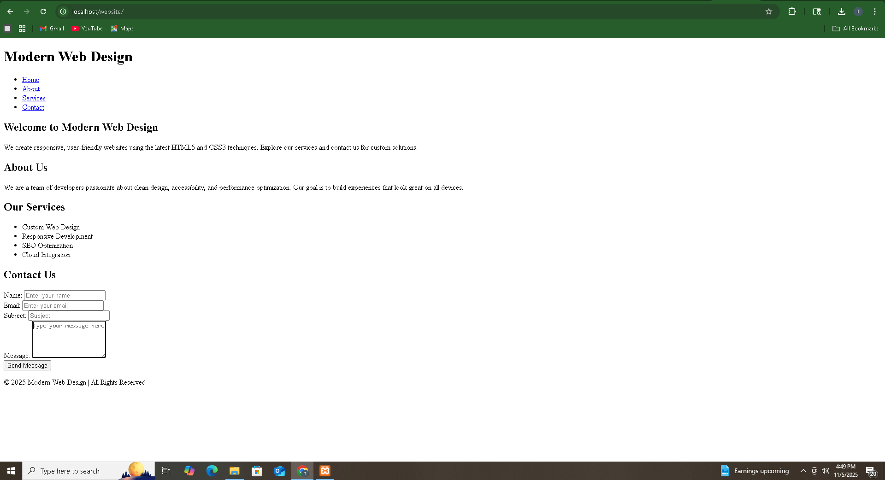

# Todd Upshaw | Final Web Design Project  
### ECPI University – Virginia Campus  
**Student ID:** todups0860  
**Date:** 11/04/2025  

---

## 🌐 Project Title
**Todd’s Tech Blog** — A fully responsive and animated blog website built using **HTML5** and **CSS3**.  
This site demonstrates a professional front-end layout using **semantic HTML**, **Flexbox**, **media queries**, and **CSS animations** for smooth user interaction.

---

## 🧩 Project Overview
This project showcases my ability to:
- Build a structured HTML5 document with semantic tags.
- Implement a responsive and clean layout using CSS Flexbox.
- Create a working contact form with input validation.
- Apply animations, transitions, and hover effects for improved UX.
- Deploy a fully functional website through **GitHub Pages**.
- Launch and test the website locally using **XAMPP**.

---

## 📁 Repository Structure
- `/blog.html`
- `/styles.css`
- `/capnew.PNG`
- `/other project assets (images, videos, etc.)`

---

## 💻 Local Hosting Screenshot
Below is a screenshot of my website hosted locally using **XAMPP**. The timestamp and URL are visible:

---

## 🚀 Deployment
The project has been deployed via **GitHub Pages**.  
Access the live site here: [Insert your GitHub Pages URL]

---

## ⚡ Features
- **Responsive Layout**: Blog articles stack vertically on small screens and side-by-side on larger screens.  
- **Flexbox Layout**: Ensures clean spacing and alignment of all content.  
- **Media Queries**: Optimized breakpoints for phones (≤767px), tablets (768px–1024px), and desktops (≥1025px).  
- **CSS Animations**: Smooth fade-in effects and hover transitions for links and form elements.  
- **Contact Form**: Includes Name, Email, Subject, and Message fields, with required validation for Name, Email, and Message.

---

## 🛠 Tools Used
- **HTML5 & CSS3**
- **Flexbox & Media Queries**
- **XAMPP** for local hosting
- **GitHub Pages** for live deployment

---

## 📌 Notes
- All sections are semantically structured for accessibility.  
- The website scales seamlessly across devices.  
- Animations and transitions enhance user experience and interactivity.  
- Screenshot and GitHub Pages link confirm both local and live hosting.

---

## 🔗 References
- GitHub Pages Documentation: https://toddupshawse.github.io/workspacecreation/
- XAMPP Documentation: [https://www.apachefriends.org/index.html](https://www.apachefriends.org/index.html)
